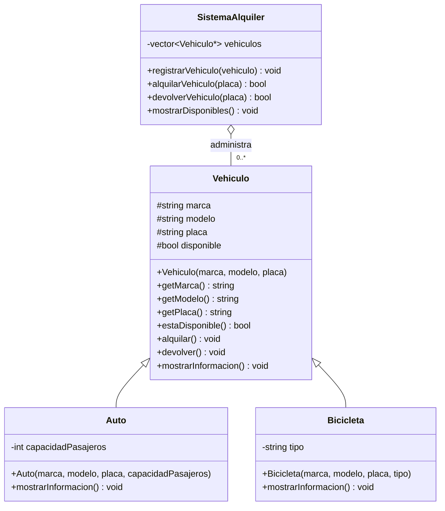

# Diagrama UML — Sistema de alquiler de vehículos

```mermaid
classDiagram
    class Vehiculo {
        #string marca
        #string modelo
        #string placa
        #bool disponible
        +Vehiculo(marca, modelo, placa)
        +getMarca() string
        +getModelo() string
        +getPlaca() string
        +estaDisponible() bool
        +alquilar() void
        +devolver() void
        +mostrarInformacion() void
    }

    class Auto {
        -int capacidadPasajeros
        +Auto(marca, modelo, placa, capacidadPasajeros)
        +mostrarInformacion() void
    }

    class Bicicleta {
        -string tipo
        +Bicicleta(marca, modelo, placa, tipo)
        +mostrarInformacion() void
    }

    class SistemaAlquiler {
        -vector~Vehiculo*~ vehiculos
        +registrarVehiculo(vehiculo) void
        +alquilarVehiculo(placa) bool
        +devolverVehiculo(placa) bool
        +mostrarDisponibles() void
    }

    Vehiculo <|-- Auto
    Vehiculo <|-- Bicicleta
    SistemaAlquiler o-- "0..*" Vehiculo : administra
```
